# 🚀 NexOps Platform

> **A production-grade, self-managed Kubernetes DevSecOps platform built from scratch on Google Cloud Platform.**

An enterprise-grade platform engineering workspace designed to showcase zero-trust networking, GitOps continuous delivery, automated vulnerability gates, and multi-environment isolation on a self-managed, VM-based Kubernetes cluster.

---

## 📖 Table of Contents

- [📋 Overview](#-overview)
- [⚡ Core Capabilities](#-core-capabilities)
- [✨ Key Features](#-key-features)
- [🏗️ Architecture](#-architecture)
- [⚙️ Infrastructure](#-infrastructure)
- [🛠️ Provisioning](#-provisioning)
- [🐧 OS Management](#-os-management)
- [☸️ Cluster Management](#-cluster-management)
- [📂 Project Structure](#-project-structure)
- [💻 Application Architecture](#-application-architecture)
- [🔄 How It Works](#-how-it-works)
- [🔀 Data Flow](#-data-flow)
- [🎨 UX Overview](#-ux-overview)
- [🏗️ Continuous Integration (CI)](#-continuous-integration-ci)
- [🚀 Continuous Delivery (CD) & GitOps](#-continuous-delivery-cd--gitops)
- [🛡️ DevSecOps Pipeline](#-devsecops-pipeline)
- [📊 Monitoring & Logging](#-monitoring--logging)
- [🗄️ Database Configurations](#-database-configurations)
- [🔌 API Documentation](#-api-documentation)
- [🔑 Authentication & Secrets Management](#-authentication--secrets-management)
- [🔌 Integrations](#-integrations)
- [🚀 Installation & Setup](#-installation--setup)
- [🔧 Configuration](#-configuration)
- [📈 Usage](#-usage)
- [🚢 Deployment](#-deployment)
- [💾 DR & Backup](#-dr--backup)
- [🔒 Security Posture](#-security-posture)
- [🔍 Troubleshooting](#-troubleshooting)
- [💬 FAQ](#-faq)
- [🔮 Future Improvements](#-future-improvements)
- [🤝 Contributing](#-contributing)
- [📄 License](#-license)
- [💖 Acknowledgements](#-acknowledgements)

---


## 📋 Overview

The **NexOps Platform** is an end-to-end, self-managed cloud and Kubernetes platform built entirely on Google Cloud Platform (GCP). Bypassing managed Kubernetes services like Google Kubernetes Engine (GKE) to demonstrate deep infrastructure and systems-level competence, this project provisions virtual machines on GCP Compute Engine using **Terraform**, configures host operating systems and bootstraps a lightweight **K3s cluster** using **Ansible**, and automates applications and systems software deployment using **ArgoCD** following **GitOps** best practices.

Every component in the architecture — from firewalls and subnets to continuous integration, security scanners, monitoring dashboards, and standalone database instances — is codified, versioned, and managed as code. The workload is structured as a modern full-stack application (Go REST API + React SPA Dashboard) deployed into separate isolated namespaces with strict network security policies, utilizing external services like a standalone PostgreSQL database isolated on a private GCP subnet.

---

## ⚡ Core Capabilities

- **Automated Infrastructure-as-Code (IaC)**: Dynamic provisioning of GCP VPC networks, subnets, routers, NAT gateways, firewall rules, and compute VMs with remote state stored in Google Cloud Storage (GCS).
- **Automated Configuration Management**: Ansible-driven OS tuning, kernel module configuration, swap disabling, and headless PostgreSQL deployment.
- **GitOps Continuous Delivery (CD)**: Declarative, self-healing application lifecycle management using ArgoCD under an App-of-Apps management pattern.
- **Dynamic CI/CD Security Gates**: Interactive Jenkins pipelines running on dynamic Kubernetes agent pods, triggering automated static analysis and vulnerability scans.
- **Zero-Trust Network Hardening**: Namespace isolation using Kubernetes NetworkPolicies that block unauthorized cross-namespace lateral traffic.
- **Automated Ingress & TLS Management**: Ingress-nginx controller with cert-manager automatically provisioning Let's Encrypt certificates via HTTP-01 challenges.
- **Full-Stack Observability**: Cluster and host telemetry gathered via Prometheus, alert routing via Alertmanager, and visualization through Grafana dashboards.

---

## ✨ Key Features

- **Decoupled Database Infrastructure**: A dedicated database VM hosted completely outside the Kubernetes cluster on a private IP address, accessible only through a Kubernetes headless Service and custom Endpoints mapping.
- **Conflict-Free Multi-Environment Layout**: Ingress host naming configuration managed via Kustomize overlays (`staging.nexops.local` for staging and `app.nexops.local` for production), preventing Nginx Ingress webhook hostname conflicts.
- **Privileged DinD Vulnerability Scanning**: Shared socket Docker-in-Docker configuration allowing pipelines to run Trivy image scans securely without exposing host credentials.
- **Dynamic Kubernetes Jenkins Agents**: Lightweight execution environment where CI build agents are created dynamically as Kubernetes pods and torn down immediately upon job completion.
- **Non-Root Execution Standards**: Backend Go containers run under non-root security contexts (UID 1000) to minimize runtime privilege escalation risks.
- **Secure Image Registry Integration**: Image pull secrets (`gar-pull-secret`) configured for automatic authentication with Google Artifact Registry (GAR).

---

## 🏗️ Architecture

The NexOps Platform utilizes a dedicated virtual private cloud (VPC) network in the GCP Jakarta region (`asia-southeast2`). The control plane and workers are assigned public IP addresses for SSH management and Ingress routing, whereas the database server is completely isolated without a public interface.

### Cloud Network and Compute Topology

```
┌────────────────────────────────────────────────────────────────────────────────────────┐
│                               GOOGLE CLOUD PLATFORM (GCP)                              │
│                             Region: asia-southeast2 (Jakarta)                          │
│                                                                                        │
│  ┌──────────────────────────────────────────────────────────────────────────────────┐  │
│  │                              VPC: nexops-vpc (10.0.1.0/24)                       │  │
│  │                                                                                  │  │
│  │  ┌────────────────────────┐  K8s API (6443)  ┌────────────────────────────────┐  │  │
│  │  │     nexops-master      │─────────────────►│         nexops-worker          │  │  │
│  │  │      (e2-medium)       │                  │        (e2-standard-4)         │  │  │
│  │  │     30 GB SSD Boot     │◄─────────────────│         60 GB SSD Boot         │  │  │
│  │  │  External Static IP   │   K3s Node Join  │       External Static IP       │  │  │
│  │  │   (Internal: 10.0.1.3) │                  │       (Internal: 10.0.1.4)     │  │  │
│  │  │  ┌──────────────────┐  │                  │  ┌──────────────────────────┐  │  │  │
│  │  │  │   K3s Server     │  │                  │  │ K3s Agent Node           │  │  │  │
│  │  │  └──────────────────┘  │                  │  ├──────────────────────────┤  │  │  │
│  │  └────────────────────────┘                  │  │ Namespaces:              │  │  │  │
│  │               │                              │  │  - argocd                │  │  │  │
│  │               │ ProxyJump SSH                │  │  - devops (Jenkins)      │  │  │  │
│  │               ▼                              │  │  - monitoring (Prom/Graf)│  │  │  │
│  │  ┌────────────────────────┐                  │  │  - ingress-nginx         │  │  │  │
│  │  │       nexops-db        │                  │  │  - cert-manager          │  │  │  │
│  │  │       (e2-small)       │◄─────────────────│  │  - staging (React/Go)    │  │  │  │
│  │  │     20 GB SSD Boot     │   Port 5432      │  │  - prod (React/Go)       │  │  │  │
│  │  │     NO External IP     │   (External DB   │  └──────────────────────────┘  │  │  │
│  │  │   PostgreSQL Server    │    Endpoint)     └────────────────────────────────┘  │  │
│  │  │   (Internal: 10.0.1.2) │                                                      │  │
│  │  └────────────────────────┘                                                      │  │
│  │                                                                                  │  │
│  │                             Cloud NAT (Outbound Only)                            │  │
│  └──────────────────────────────────────────────────────────────────────────────────┘  │
└────────────────────────────────────────────────────────────────────────────────────────┘
```

---

## ⚙️ Infrastructure

The underlying infrastructure is defined using modularized Terraform code located in [terraform/](file:///d:/Github%20All%20Repo/nexops-platform/terraform).

- **VPC Configuration**: Custom VPC `nexops-vpc` and subnet `nexops-subnet` (`10.0.1.0/24`). Outbound internet traffic for private nodes is routed through a Cloud NAT gateway backed by a Cloud Router.
- **Firewall Rules**:
  - `allow-ssh`: Permits SSH (Port 22) traffic from public sources to instances tagged with `nexops-node`.
  - `allow-k3s-api`: Permits external connections to K3s Control Plane (Port 6443).
  - `allow-http-https`: Permits ports 80 and 443 inbound to nodes hosting the ingress controllers (`nexops-worker`).
  - `allow-k8s-nodeports`: Opens ports 30000-32767 for external service validation testing.
  - `allow-vpc-internal`: Permits unrestricted communication between all internal IP addresses on the `10.0.1.0/24` subnet.
- **Instance Allocation**:
  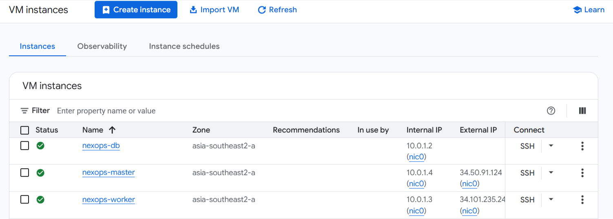
  - `nexops-master`: Instantiated on an `e2-medium` machine type with a 30 GB SSD boot disk.
  - `nexops-worker`: Instantiated on an `e2-standard-4` machine type with a 60 GB SSD boot disk.
  - `nexops-db`: Instantiated on an `e2-small` machine type with a 20 GB SSD boot disk. No external IP is assigned to this instance.
- **Remote State**: Backed by a GCP Cloud Storage bucket named `nexops-tfstate-rinemaa-457218`.

---

## 🛠️ Provisioning

Terraform initializes the cloud fabric and generates deployment configurations.

1. **State Bootstrapping**: The `gcs` backend stores state files under the key `terraform/state`.
2. **Metadata Injection**: Installs SSH keys dynamically for user `nexops` onto all provisioned hosts.
3. **Execution Snippets**: An output snippet `ansible_inventory_snippet` prints the dynamic IP mappings directly to `ansible/inventory/hosts.ini` layout format:
   ```ini
   [master]
   nexops-master ansible_host=<master-public-ip> ansible_user=nexops ansible_ssh_private_key_file=~/.ssh/nexops_rsa

   [worker]
   nexops-worker ansible_host=<worker-public-ip> ansible_user=nexops ansible_ssh_private_key_file=~/.ssh/nexops_rsa

   [db]
   nexops-db ansible_host=10.0.1.2 ansible_user=nexops ansible_ssh_private_key_file=~/.ssh/nexops_rsa ansible_ssh_common_args='-o ProxyJump=nexops@<master-public-ip>'
   ```

---

## 🐧 OS Management

System configurations and packages are managed by Ansible roles in [ansible/roles/](file:///d:/Github%20All%20Repo/nexops-platform/ansible/roles).

- **Role: `common`**: Executed across all instances (`master`, `worker`, `db`).
  - Updates APT packages cache and performs a system upgrade.
  - Installs core utilities: `curl`, `wget`, `git`, `unzip`, `jq`, `htop`, `vim`, `nfs-common`, `ca-certificates`, `socat`, `conntrack`, `ipset`.
  - Disables swap space immediately (`swapoff -a`) and strips swap device mappings from `/etc/fstab` to comply with Kubernetes runtime standards.
  - Loads required host kernel modules: `overlay` and `br_netfilter` for bridge interface networking.
  - Injects sysctl parameters via `/etc/sysctl.d/k8s.conf`:
    - `net.bridge.bridge-nf-call-iptables = 1`
    - `net.bridge.bridge-nf-call-ip6tables = 1`
    - `net.ipv4.ip_forward = 1`
    - `fs.inotify.max_user_watches = 524288`
    - `fs.inotify.max_user_instances = 512`
    - `vm.max_map_count = 262144` (required for SonarQube's Elasticsearch module).
  - Configures names inside `/etc/hosts` for node-to-node host resolution.

---

## ☸️ Cluster Management

K3s bootstrap steps are managed by the roles `k3s-master` and `k3s-worker` in [ansible/playbooks/](file:///d:/Github%20All%20Repo/nexops-platform/ansible/playbooks).

- **K3s Server Setup**:
  - Installs the control plane on `nexops-master` with arguments:
    ```bash
    curl -sfL https://get.k3s.io | INSTALL_K3S_EXEC="server \
      --disable=traefik \
      --flannel-backend=vxlan \
      --node-name=nexops-master \
      --write-kubeconfig-mode=644 \
      --tls-san=<master-public-ip>" sh -
    ```
  - Traefik is disabled in favor of an ingress-nginx DaemonSet deployment.
  - Extracts the joining token from `/var/lib/rancher/k3s/server/node-token`.
  - Downloads the `/etc/rancher/k3s/k3s.yaml` file, automatically rewriting the localhost IP to the master's public IP address, saving it to `ansible/kubeconfig.yaml`.
- **K3s Agent Join**:
  - Bootstraps `nexops-worker`, joining it to the master control plane:
    ```bash
    curl -sfL https://get.k3s.io | K3S_URL=https://<master-ip>:6443 \
      K3S_TOKEN=<cluster-token> \
      INSTALL_K3S_EXEC="agent --node-name=nexops-worker" sh -
    ```
- **CLI Setup**: Installs Helm v3 client on the master node and creates a symbolic link for `kubectl`.

---

## 📂 Project Structure

```
nexops-platform/
├── .github/                  # GitHub workflow configurations
├── ansible/                  # Ansible playbooks and host setups
│   ├── inventory/            # Host inventory definition files
│   ├── playbooks/            # Orchestration execution playbooks
│   │   ├── 01-common.yml     # OS baseline setup
│   │   ├── 02-k3s-master.yml # Control plane installation
│   │   ├── 03-k3s-worker.yml # Worker join configuration
│   │   └── 04-postgresql.yml # Standalone database configuration
│   ├── roles/                # Modular configuration task definitions
│   │   ├── common/           # Hardening and kernel parameter changes
│   │   ├── k3s-master/       # Master bootstrapping and token retrieval
│   │   ├── k3s-worker/       # Worker registration task definitions
│   │   └── postgresql/       # DB instance configuration and users
│   ├── ansible.cfg           # Local Ansible behaviors configuration
│   ├── kubeconfig.yaml       # Gitignored cluster client configuration
│   └── site.yml              # Root execution entrypoint
├── applications/             # Application codebase and K8s manifests
│   ├── backend/              # Go RESTful API source files
│   │   ├── Dockerfile        # Multi-stage Docker file using Golang 1.24
│   │   ├── go.mod            # Go module dependencies
│   │   └── main.go           # REST routing and database client setup
│   ├── database/             # Schema definitions
│   │   └── init.sql          # DB tables setup script
│   ├── frontend/             # React SPA Dashboard codebase
│   │   ├── src/              # React source files (App.jsx, main.jsx)
│   │   ├── Dockerfile        # Nginx-based multi-stage runtime Dockerfile
│   │   ├── index.html        # SPA root element document
│   │   ├── package.json      # Node dependency versions
│   │   └── vite.config.js    # Vite builder config
│   ├── k8s/                  # Kubernetes resource configurations
│   │   ├── base/             # Kustomize base deployment files
│   │   │   ├── backend.yaml  # Go backend Deployments and Services
│   │   │   ├── db-service.yaml# Headless database Service + Endpoints
│   │   │   ├── frontend.yaml # React frontend Deployments and Services
│   │   │   ├── ingress.yaml  # Default ingress rule definitions
│   │   │   └── kustomization.yaml # Kustomize base setup mapping
│   │   └── overlays/         # Environment specific patches
│   │       ├── prod/         # Production deployment mapping
│   │       │   └── kustomization.yaml
│   │       └── staging/      # Staging deployment mapping
│   │           └── kustomization.yaml # Overwrites hostnames and secrets
│   └── Jenkinsfile           # 7-stage DevSecOps Jenkins pipeline
├── argocd/                   # GitOps orchestration resource files
│   ├── apps/                 # Application bootstrap manifests
│   │   ├── cert-manager.yaml # Cert-manager App manifest (Helm v1.14.5)
│   │   ├── ingress-nginx.yaml# Nginx Ingress App manifest (Helm 4.10.1)
│   │   ├── jenkins.yaml      # Jenkins App manifest (Helm 5.1.30)
│   │   ├── monitoring.yaml   # Prometheus-Grafana App (Helm 58.6.0)
│   │   ├── prod-app.yaml     # Prod Env App pointing to overlays/prod
│   │   ├── sonarqube.yaml    # Sonarqube App manifest (Helm 10.5.1)
│   │   └── staging-app.yaml  # Staging Env App pointing to overlays/staging
│   └── app-of-apps.yaml      # Root Application monitoring argocd/apps/
├── kubernetes/               # Cluster bootstrap resource declarations
│   └── bootstrap/            # Direct-applied namespaces and issuers
│       ├── argocd-ingress.yaml # Exposed HTTPS ingress configurations
│       ├── cluster-issuers.yaml# Cert-manager Let's Encrypt configurations
│       └── namespaces.yaml   # Namespaces definitions
├── security/                 # System security hardening resources
│   └── network-policies/     # Strict default-deny NetworkPolicies
└── README.md                 # Project documentation
```

---

## 💻 Application Architecture

The sample application deployed on the cluster is a split-tier React dashboard communicating with a Go database API.

```
                  ┌──────────────────────┐
                  │    React Frontend    │ (React 19 + Vite 8 + Tailwind CSS v4)
                  │   Served via Nginx   │ (Exposed on Port 80 inside container)
                  └──────────┬───────────┘
                             │
                             │ REST API Requests (via Ingress)
                             ▼
                  ┌──────────────────────┐
                  │      Go Backend      │ (Golang 1.24 + lib/pq runtime)
                  │   Runs as Non-Root   │ (Exposed on Port 8080 inside container)
                  └──────────┬───────────┘
                             │
                             │ JDBC/SQL Connection (Port 5432)
                             ▼
                  ┌──────────────────────┐
                  │ PostgreSQL Database  │ (Hosted on standalone VM: 10.0.1.2)
                  │  Standalone Instance │ (Managed outside the cluster)
                  └──────────────────────┘
```

- **Frontend SPA**: React 19 / Tailwind CSS v4 dashboard compiled using Vite. It queries the Go API and renders interactive telemetry cards. Hosted in an `nginx:alpine` container with static assets copied directly to `/usr/share/nginx/html`.
- **Backend API**: Written in Go (Golang 1.24). Listens on port 8080 and handles REST API routes. Built in a multi-stage `golang:1.24-alpine` image to output a lightweight binary running in `alpine:3.19`. Executed under security context properties enforcing a non-privileged system user account (`runAsUser: 1000`).
- **Database Init**: An initialization script [applications/database/init.sql](file:///d:/Github%20All%20Repo/nexops-platform/applications/database/init.sql) configures tables to trace deployment records and monitor check actions.

---

## 🔄 How It Works

```
                                  +-----------------------+
                                  |    Developer Push     |
                                  +-----------+-----------+
                                              |
                                              v
                                  +-----------------------+
                                  |   GitHub Repository   |
                                  +-----------+-----------+
                                              | Webhook
                                              v
                                  +-----------------------+
                                  |   Jenkins Controller  |
                                  +-----------+-----------+
                                              | Spawns Pod
                                              v
    +-----------------------------------------+-----------------------------------------+
    |                                   Dynamic Agent Pod                               |
    |                                                                                   |
    |  +------------------+    +------------------+    +------------------+             |
    |  |  Trivy FS Scan   |--->|  SonarQube SAST  |--->|   Docker Build   |             |
    |  |  (Vulnerability) |    |  (Quality Gate)  |    |  (Build Images)  |             |
    |  +------------------+    +------------------+    +--------+---------+             |
    |                                                           |                       |
    |  +------------------+    +------------------+             v                       |
    |  | Git push tag update |<---|  Push Images GAR  |<---| Trivy Image Scan|          |
    |  | (Writeback Stage)  |    | (Docker Registry)|    |  (Container CVE) |          |
    |  +--------+---------+    +------------------+    +------------------+             |
    +-----------|-----------------------------------------------------------------------+
                |
                v
    +-----------+-----------+
    |   GitHub Repo Updated |
    +-----------+-----------+
                |
                v
    +-----------+-----------+
    |         ArgoCD        |
    +-----------+-----------+
          |           |
          |           +---------------------------------+
          | Auto-Sync                                   | Manual Promotion
          v                                             v
  +-------+-------+                             +-------+-------+
  |    Staging    |                             |   Production  |
  |   Namespace   |                             |   Namespace   |
  +---------------+                             +---------------+
```

The delivery cycle operates through a strict git-driven pipeline. 

1. **Commit Phase**: A developer pushes code changes to the GitHub repository.
2. **Pipeline Trigger**: GitHub sends a webhook event to the Jenkins controller running in the `devops` namespace.
3. **Agent Provisioning**: Jenkins communicates with the Kubernetes API to launch a dynamic worker pod using a multi-container pod template (jnlp, docker, trivy, sonar-scanner, tools).
4. **Vulnerability Gate**: The pipeline runs code quality assessments and checks dependencies for vulnerabilities. If SonarQube quality gates or Trivy container scans identify critical issues, the pipeline aborts immediately.
5. **Publish Phase**: Clean Docker images are tagged using the build number and Git commit SHA format (`${BUILD_NUMBER}-${GIT_COMMIT.take(7)}`) and pushed to the Google Artifact Registry.
6. **GitOps Writeback**: Jenkins updates the image tags in the Kustomize base deployment manifests (`applications/k8s/base/backend.yaml` and `frontend.yaml`) and commits the changes back to GitHub.
7. **ArgoCD Sync**: ArgoCD detects the modification in the Git repository. It syncs changes automatically to the `staging` namespace, while changes to the `prod` namespace are queued for manual promotion.

---

## 🔀 Data Flow

When a client loads the application dashboard, traffic is routed through the system tiers:

```
[Client Web Browser] 
       │ 
       ▼ Ingress Traffic (HTTPS Port 443)
[Nginx Ingress Controller (DaemonSet)]
       │
       ├─► Path: "/" ────► [Service: nexops-frontend:80] ────► [Pods: nexops-frontend] (Nginx static files)
       │
       └─► Path: "/api" ──► [Service: nexops-backend:80] ────► [Pods: nexops-backend] (Go API server)
                                                                       │
                                                                       ▼ SQL Connection (Port 5432)
                                                             [Service: nexops-db:5432] (Headless)
                                                                       │
                                                                       ▼ Endpoint Redirection
                                                             [PostgreSQL VM Node (10.0.1.2)]
```

1. **Host Header Resolution**: The client web browser initiates requests targeting `https://app.nexops.local` (or `staging.nexops.local`).
2. **Ingress Entrypoint**: Ingress controller processes the host header and maps the request paths:
   - `/` path matches the frontend React service.
   - `/api/*` path matches the Go backend service.
3. **UI Loading**: The web browser downloads the React Single Page Application and runs the dashboard scripts locally.
4. **API Execution**: The client browser makes asynchronous queries to `/api/info` or `/api/ready`. The ingress controller forwards this traffic to the Go backend pods.
5. **Database Routing**: The Go backend initiates SQL requests pointing to `nexops-db.default.svc.cluster.local:5432`.
6. **External Redirection**: The Kubernetes DNS resolves `nexops-db` to a headless service mapped to endpoints point to the private IP address `10.0.1.2`. The internal router directs the TCP traffic across nodes directly to the PostgreSQL instance running on the database VM.

---

## 🎨 UX Overview

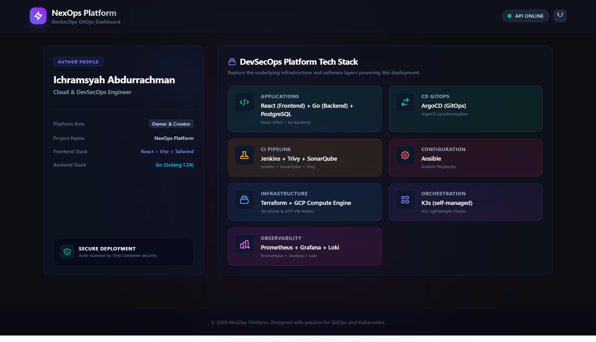

The frontend dashboard interface is built to provide an interactive control panel for platform administrators:

- **Glassmorphic Theme**: Dark mode design (`bg-[#0d0e12]`) featuring subtle indigo/purple blurred background blobs, translucent panels, and thin borders (`border-slate-800/80`).
- **Telemetry Indicators**: Includes an API Status Indicator badge in the navigation bar. If the API is unreachable, a pulsing red status dot warns the user; otherwise, a pulsing green indicator shows active operations.
- **Interactive Stack Explorer**: Telemetry cards display the systems running on the cluster:
  - **Infrastructure**: GCP Compute Engine instances configured via Terraform.
  - **Configuration**: Host configuration via Ansible.
  - **Orchestration**: Self-managed K3s cluster nodes.
  - **CI Pipeline**: Jenkins build engine running SonarQube & Trivy.
  - **CD GitOps**: Automated synchronization with ArgoCD.
  - **Observability**: Telemetry visualization with Prometheus & Grafana.
  - **Application**: Go APIs and React SPA runtimes.
- **Manual Control**: A refresh button allows users to manually re-evaluate the state of the Go API and database links on demand.

---

## 🏗️ Continuous Integration (CI)

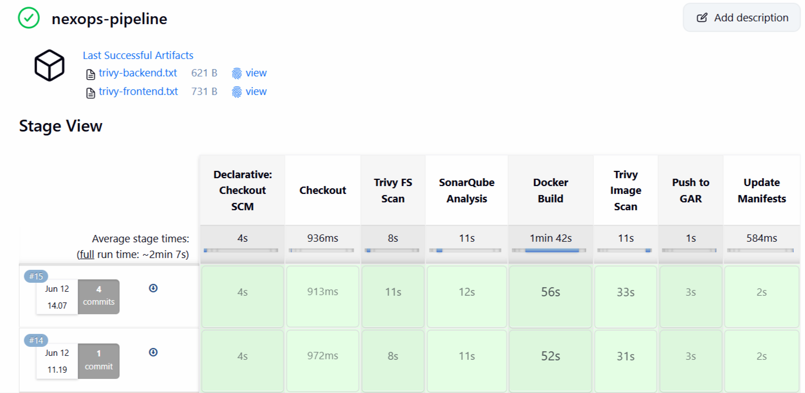
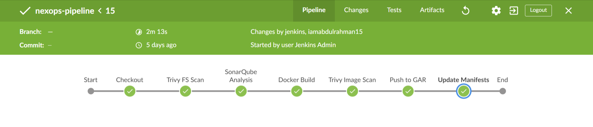

Continuous Integration is managed via a declarative Jenkins pipeline script [applications/Jenkinsfile](file:///d:/Github%20All%20Repo/nexops-platform/applications/Jenkinsfile) executed inside a Kubernetes cloud provider.

- **Dynamic Agent Pod**: Configured dynamically using a Pod Template containing:
  - `jnlp`: The default Jenkins inbound agent handler (`jenkins/inbound-agent:latest`).
  - `docker`: A privileged Docker-in-Docker sidecar (`docker:dind`) with MTU configuration set to 1400.
  - `trivy`: Aqua Security image scanner (`aquasec/trivy:latest`) with command overrides.
  - `sonar-scanner`: SonarQube analysis CLI tool container (`sonarsource/sonar-scanner-cli:latest`).
  - `tools`: Lightweight Git operations utility wrapper (`alpine/git:latest`).
- **Storage Volume**: An `emptyDir` mount named `docker-storage` is attached to `/var/lib/docker` in the `docker` container, ensuring clean container workspaces for every run.
- **Job Options**: Implements a 45-minute timeout window and blocks concurrent builds to prevent race conditions during writeback steps.

---

## 🚀 Continuous Delivery (CD) & GitOps

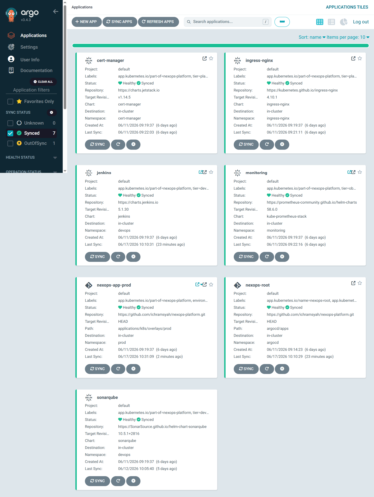

Continuous delivery follows the GitOps pattern managed by ArgoCD.

- **Parent Root Application**: The `nexops-root` application in [argocd/app-of-apps.yaml](file:///d:/Github%20All%20Repo/nexops-platform/argocd/app-of-apps.yaml) tracks the directory `argocd/apps/` inside the Git repository.
- **Self-Healing Mechanics**: Automated pruning (`prune: true`) and self-healing (`selfHeal: true`) are enabled for all applications. If cluster resources are modified manually, ArgoCD automatically reconciles the state back to the Git source configuration.
- **Environment Promotion Split**:
  - **Staging (`nexops-app-staging`)**: Tracks the path `applications/k8s/overlays/staging` with automatic sync enabled.
  - **Production (`nexops-app-prod`)**: Tracks `applications/k8s/overlays/prod` with automated prune disabled. This requires a manual click or API trigger inside the ArgoCD console to promote changes to production.

---

## 🛡️ DevSecOps Pipeline

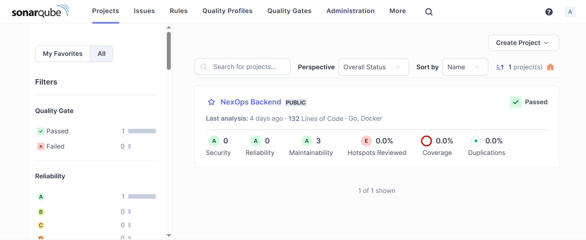

The DevSecOps pipeline builds safety checks directly into the continuous integration steps.

1. **Trivy File System Scanning**: Scans source directories (`./applications/backend` and `./applications/frontend`) for secrets, plain text credentials, or packages containing CVEs. Generates reports archived as build artifacts.
2. **SonarQube Quality Gate**: Executes code quality scans targeting the Go API code using the `sonar-scanner` container. The build process blocks if code coverage drops or SAST alerts are triggered.
3. **Privileged Image Scanning**: Since building images inside dynamic Kubernetes pods can lead to nested Docker socket access problems, the pipeline runs Trivy container checks inside the DinD container:
   ```bash
   docker run --rm -v /var/run/docker.sock:/var/run/docker.sock \
     aquasec/trivy:latest image --exit-code 1 --severity CRITICAL \
     ${IMAGE_PREFIX}/backend:${IMAGE_TAG}
   ```
   If a container image contains a **CRITICAL** vulnerability, the scanner returns exit code 1, and the pipeline halts before pushing images to the registry.
4. **Registry Authentication**: Uses a GCP service account JSON key stored as a Jenkins credential (`gcp-gar-service-account-key`) to authenticate with the regional Docker repository `asia-southeast2-docker.pkg.dev`.

---

## 📊 Monitoring & Logging

### Grafana Dashboards Gallery

| Dashboard | Visual Preview |
| :--- | :--- |
| **All Dashboards Overview** | 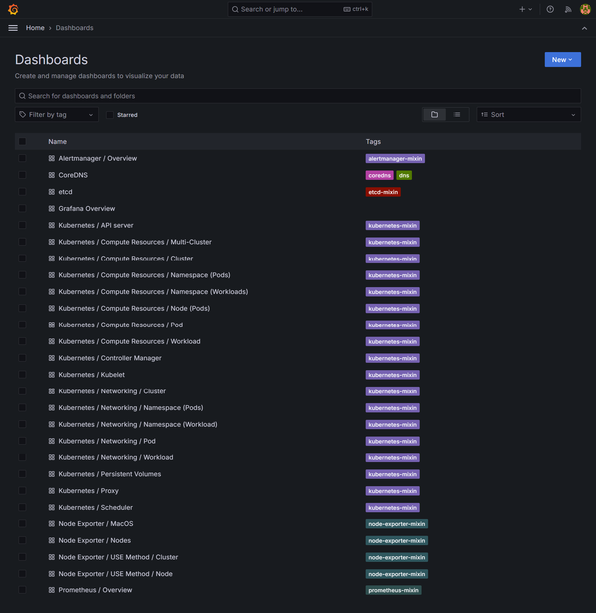 |
| **Kubernetes Cluster Compute Resources** | 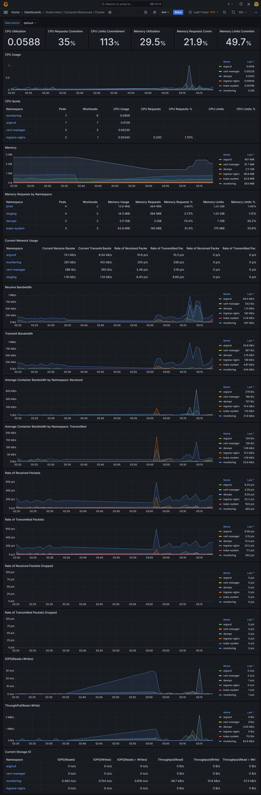 |
| **Kubernetes Compute Resources (Namespace/Pods)** | 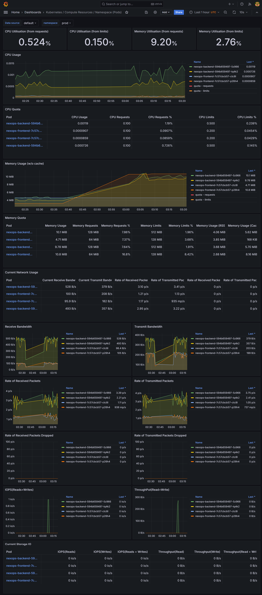 |
| **Node Exporter Host Nodes** | 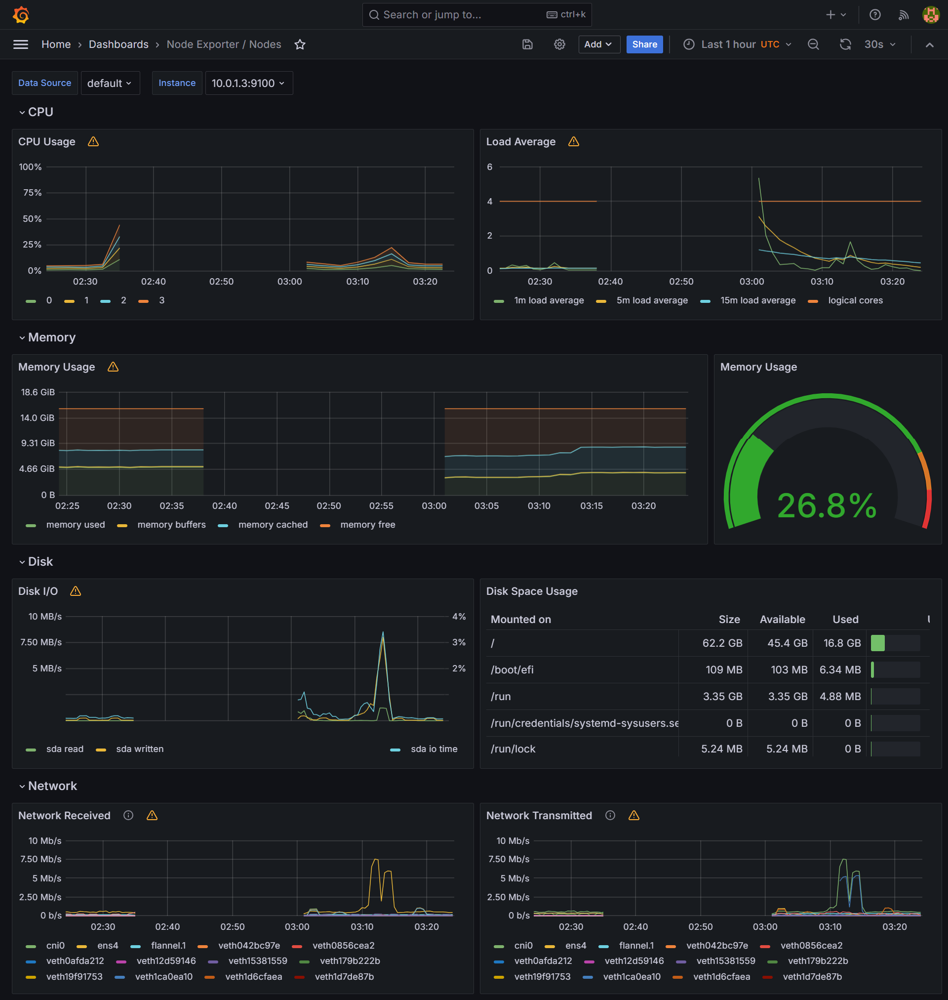 |
| **CoreDNS Metrics** | 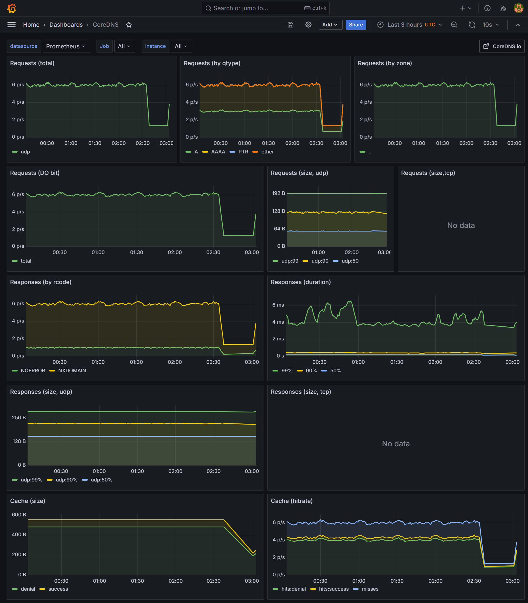 |
| **Kubernetes API Server Telemetry** | 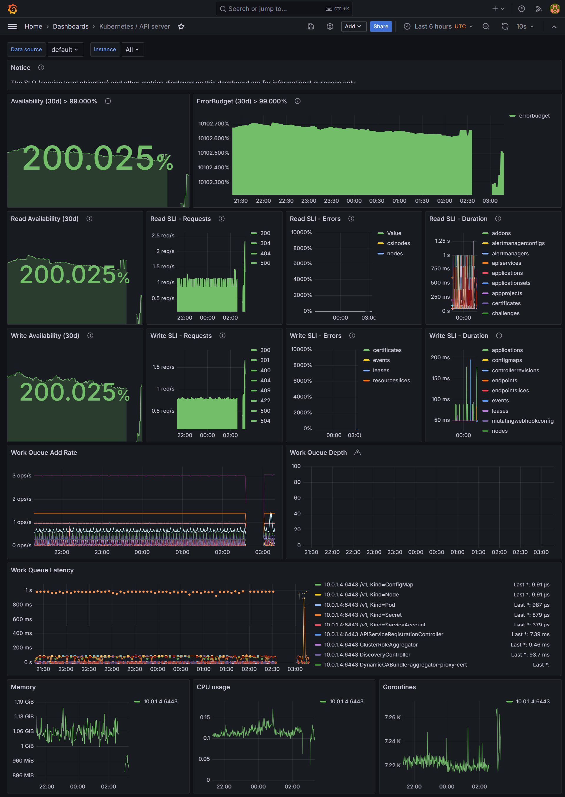 |

Telemetry operations are managed by Prometheus, Grafana, and Alertmanager deployed via Helm.

- **Prometheus Stack**: Bootstrapped via ArgoCD using the Helm chart `kube-prometheus-stack` (v58.6.0).
  - **Prometheus Server**: Standardized with a 20 GB Persistent Volume Claim and a 15-day metrics retention window.
  - **Grafana Server**: Deployed with a 5 GB volume claim. Admin access credentials: `nexops-grafana-2024`.
  - **Dashboards**: Features a dynamic sidecar configuration provider that scans namespaces for ConfigMaps tagged with the label `grafana_dashboard=1`, importing dashboards automatically.
- **Exporters**: Installs `node-exporter` as a DaemonSet to track CPU, memory, disk, and network stats on the VM instances, alongside `kube-state-metrics` for cluster workload data.
- **Logging**: Designed for Loki integration using Promtail agents for container log aggregation.

---

## 🗄️ Database Configurations

A dedicated PostgreSQL 14 instance is deployed on the `nexops-db` VM by the `postgresql` Ansible role.

- **Service Hardening**: The engine is configured to bind to all network interfaces (`listen_addresses = '*'`), but access is restricted at the host network layer.
- **Host Authentication Restrictions**: The file `/etc/postgresql/14/main/pg_hba.conf` allows database access only to connections originating from the Kubernetes subnet:
  ```hba
  host    all             all             10.0.1.0/24             md5
  ```
- **System Accounts**: Provisions two isolated database user accounts and databases:
  - User `sonarqube` (Password: `sonarqube_secret_pw`) owning database `sonarqube`.
  - User `nexops_app` (Password: `nexops_app_secret_pw`) owning database `nexops_app`.
- **Headless Kubernetes Integration**: To connect backend pods to the external database, the cluster maps the host IP using a headless Service and Endpoints manifest:
  ```yaml
  apiVersion: v1
  kind: Service
  metadata:
    name: nexops-db
    namespace: default
  spec:
    ports:
      - port: 5432
  ---
  apiVersion: v1
  kind: Endpoints
  metadata:
    name: nexops-db
    namespace: default
  subsets:
    - addresses:
        - ip: 10.0.1.2
      ports:
        - port: 5432
  ```

---

## 🔌 API Documentation

The Go API backend exposes four REST endpoints on port 8080.

### 1. Welcome Info
- **URL**: `GET /api/`
- **Response Code**: `200 OK`
- **Content-Type**: `application/json`
- **Response Payload**:
  ```json
  {
    "service": "nexops-backend",
    "environment": "staging",
    "version": "1.0.4",
    "status": "healthy",
    "message": "Welcome to NexOps Backend API (Go) — built by Ichramsyah Abdurrachman"
  }
  ```

### 2. Liveness Check
- **URL**: `GET /api/health`
- **Response Code**: `200 OK`
- **Content-Type**: `application/json`
- **Response Payload**:
  ```json
  {
    "status": "ok"
  }
  ```

### 3. Readiness check (Database Ping)
- **URL**: `GET /api/ready`
- **Response Code**: `200 OK` (Healthy) or `503 Service Unavailable` (Database offline)
- **Content-Type**: `application/json`
- **Success Response**:
  ```json
  {
    "status": "ready",
    "db": "connected"
  }
  ```
- **Failure Response**:
  ```json
  {
    "status": "not_ready",
    "db": "unreachable",
    "error": "sql: database is closed"
  }
  ```

### 4. Tech Stack Details
- **URL**: `GET /api/info`
- **Response Code**: `200 OK`
- **Content-Type**: `application/json`
- **Response Payload**:
  ```json
  {
    "platform": "NexOps Platform",
    "author": "Ichramsyah Abdurrachman",
    "stack": {
      "infra": "Terraform + GCP Compute Engine",
      "config_mgmt": "Ansible",
      "kubernetes": "K3s (self-managed)",
      "ci": "Jenkins + Trivy + SonarQube",
      "cd": "ArgoCD (GitOps)",
      "observability": "Prometheus + Grafana + Loki",
      "application": "React (Frontend) + Go (Backend) + PostgreSQL"
    }
  }
  ```

---

## 🔑 Authentication & Secrets Management

The platform manages credentials using a mix of GitOps overrides and runtime Kubernetes secrets.

- **Registry Access Secret**: A secret named `gar-pull-secret` containing base64 registry credentials is provisioned in the application namespaces (`staging`, `prod`) to pull images from Google Artifact Registry.
- **Database Credentials**: Secrets named `nexops-app-db-secret` containing PostgreSQL parameters are provisioned inside the target namespaces:
  ```bash
  kubectl create secret generic nexops-app-db-secret \
    --from-literal=db_name=nexops_app \
    --from-literal=db_user=nexops_app \
    --from-literal=db_password=nexops_app_secret_pw \
    -n staging
  ```
- **System Admin Credentials**:
  - Jenkins: Admin user `admin` with password `nexops-jenkins-2024` (defined via Helm values).
  - Grafana: Admin user `admin` with password `nexops-grafana-2024`.
  - ArgoCD: Decoded dynamically from the bootstrap secret `argocd-initial-admin-secret`.
- **GitOps Keyrings**: Injected into Jenkins using credential IDs `github-pat` (GitHub Personal Access Token) and `sonarqube-token` (SonarQube client token).

---

## 🔌 Integrations

- **GitHub Integrations**: Webhooks connect GitHub pushes to the Jenkins cluster API. Ingress rules route traffic from external triggers directly to the controller.
- **Let's Encrypt / Cert-Manager Integration**: The ingress controller communicates with cert-manager ClusterIssuers (`letsencrypt-prod` / `letsencrypt-staging`) to initiate ACME HTTP-01 challenges. Cert-manager provisions and stores SSL certificates in Kubernetes TLS secrets.
- **Jenkins Kubernetes Integration**: Jenkins uses the Kubernetes plugin to dynamically schedule agent pods. Jenkins controller communicates with the API server (`https://kubernetes.default.svc`) using a ServiceAccount token.
- **SonarQube Scanner & Server**: The scanner container sends analysis files to `http://sonarqube-sonarqube.devops.svc.cluster.local:9000` via the internal cluster network.

---

## 🚀 Installation & Setup

Follow this sequence to install and bootstrap the platform from scratch.

### Prerequisites
- Terraform >= 1.5.0 installed.
- Ansible >= 2.14 installed.
- Google Cloud SDK CLI installed and authenticated.
- Local SSH key pair `~/.ssh/nexops_rsa`.

### Step 1: Generate SSH Keys
```bash
ssh-keygen -t rsa -b 4096 -f ~/.ssh/nexops_rsa -C "nexops@platform"
```

### Step 2: Deploy Infrastructure via Terraform
```bash
cd terraform/
terraform init
terraform plan -out=tfplan
terraform apply tfplan
```

### Step 3: Populate Ansible Inventory
Export the generated Ansible config block from Terraform outputs and save it to the inventory file:
```bash
terraform output -raw ansible_inventory_snippet > ../ansible/inventory/hosts.ini
```

### Step 4: Run Ansible Playbooks
```bash
cd ../ansible/
# Configure common settings, disable swap, configure kernel params
ansible-playbook -i inventory/hosts.ini playbooks/01-common.yml
# Deploy external PostgreSQL instance on DB VM
ansible-playbook -i inventory/hosts.ini playbooks/04-postgresql.yml
# Deploy K3s control plane on Master VM
ansible-playbook -i inventory/hosts.ini playbooks/02-k3s-master.yml
# Register Worker VM as cluster node
ansible-playbook -i inventory/hosts.ini playbooks/03-k3s-worker.yml
```

### Step 5: Verify Cluster Nodes
```bash
export KUBECONFIG=$(pwd)/kubeconfig.yaml
kubectl get nodes -o wide
```

### Step 6: Bootstrap ArgoCD and System Tools
Apply core namespaces and boot the App-of-Apps controller:
```bash
cd ../
# Create system namespaces
kubectl apply -f kubernetes/bootstrap/namespaces.yaml

# Install ArgoCD
kubectl apply -n argocd -f https://raw.githubusercontent.com/argoproj/argo-cd/stable/manifests/install.yaml
kubectl wait --for=condition=available deployment/argocd-server -n argocd --timeout=150s

# Deploy Root application
kubectl apply -f argocd/app-of-apps.yaml
```

---

## 🔧 Configuration

To adapt the platform configuration variables to your environment:

- **Terraform Settings**: Modify region, zone, instance sizes, and disk variables inside [terraform/variables.tf](file:///d:/Github%20All%20Repo/nexops-platform/terraform/variables.tf).
- **Subnet IP Ranges**: Modify `subnet_cidr` inside variables.tf to allocate a different range than `10.0.1.0/24`. If modified, update the database host authentication permissions range in `ansible/roles/postgresql/tasks/main.yml` to match.
- **Domains and Ingresses**: To customize host names, update the Ingress definitions under [applications/k8s/base/ingress.yaml](file:///d:/Github%20All%20Repo/nexops-platform/applications/k8s/base/ingress.yaml) and the patches in [applications/k8s/overlays/staging/kustomization.yaml](file:///d:/Github%20All%20Repo/nexops-platform/applications/k8s/overlays/staging/kustomization.yaml).

---

## 📈 Usage

### Retrieve ArgoCD Admin Password
```bash
kubectl -n argocd get secret argocd-initial-admin-secret -o jsonpath="{.data.password}" | base64 -d
```

### Extract Kubernetes Configuration
Copy the configuration generated during Ansible execution to local directory config to manage via local tools:
```bash
cp ansible/kubeconfig.yaml ~/.kube/config
```

### Access observability dashboards
Port-forward Grafana:
```bash
kubectl port-forward service/monitoring-grafana -n monitoring 3000:80
```
Navigate to `http://localhost:3000` (User: `admin`, Password: `nexops-grafana-2024`).

---

## 🚢 Deployment

The application features separate deployment overlay options:

- **Base Files**: Contains base Kubernetes configuration manifests under `applications/k8s/base/`. Tracks `app.nexops.local` (production).
  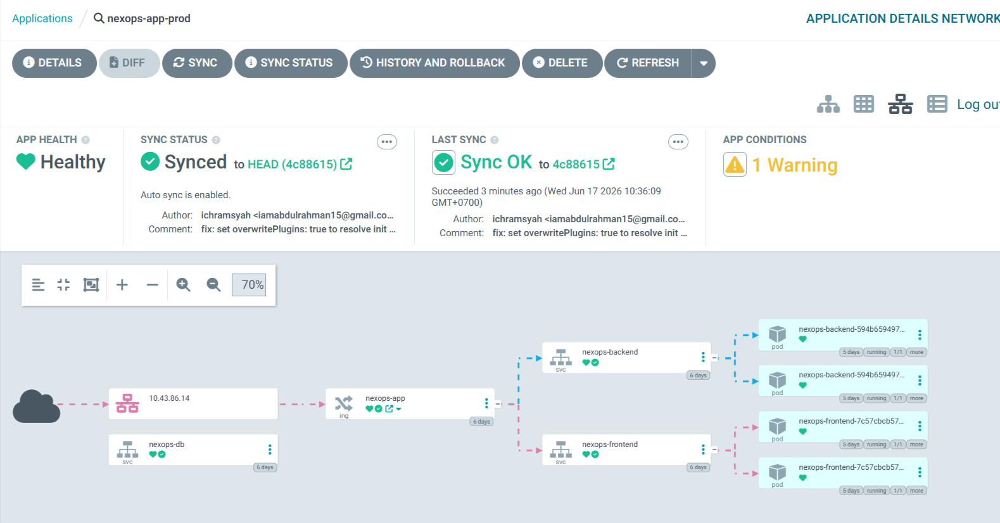
- **Staging Patch**: Configured inside `applications/k8s/overlays/staging/` to patch host names to `staging.nexops.local` using Kustomize:
  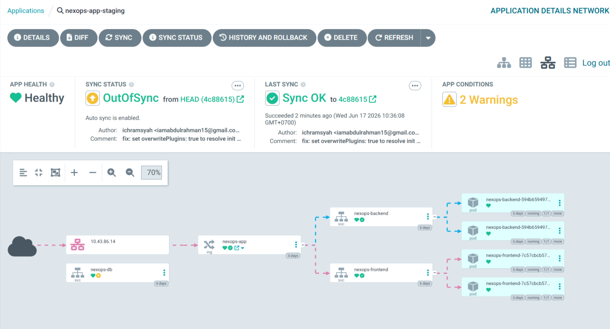
  ```yaml
  patches:
    - patch: |
        apiVersion: networking.k8s.io/v1
        kind: Ingress
        metadata:
          name: nexops-app
        spec:
          rules:
          - host: staging.nexops.local
  ```
- **Deploy Trigger**: Commit updates to Git. Staging will run the update pipeline and sync automatically. Production sync is triggered manually within the ArgoCD console for controlled releases.

---

## 💾 DR & Backup

- **State File Isolation**: The GCS backend bucket includes versioning configuration to prevent state file corruption.
- **Infrastructure Recovery**: If a node fails, Terraform can replace individual compute VMs (`terraform apply -replace=module.compute.google_compute_instance.worker`).
- **Database Backups**: Backup script outputs can be generated on the standalone DB host using a cron job running `pg_dump`:
  ```bash
  pg_dump -U nexops_app nexops_app > /var/backups/nexops_app_$(date +%F).sql
  ```
- **Git Single Source of Truth**: The entire state of the cluster (except application secrets) is versioned in Git. If the cluster is lost, running the Ansible playbooks and applying `argocd/app-of-apps.yaml` restores the exact cluster state.

---

## 🔒 Security Posture

- **Namespace Isolation (Zero-Trust)**: Default deny-all ingress policies restrict container traffic:
  ```yaml
  apiVersion: networking.k8s.io/v1
  kind: NetworkPolicy
  metadata:
    name: default-deny-ingress
    namespace: prod
  spec:
    podSelector: {}
    policyTypes:
      - Ingress
  ```
- **Ingress Whitelisting**: The frontend and backend pods accept ingress traffic only from the `ingress-nginx` and `monitoring` namespaces.
- **Process Privilege Reductions**: backend container images build as non-root to prevent kernel-level privilege escalation.
- **Database Access Network Limits**: The PostgreSQL instance is hosted on a VM with no public IP. Database ports are blocked by GCP firewall rules from any external sources outside the `10.0.1.0/24` subnet.

---

## 🔍 Troubleshooting

### 1. Ingress Host Conflict / Webhook Rejection
- **Symptom**: Applying staging manifests throws validation errors: `nginx ingress controller webhook denied admission due to duplicate host`.
- **Reason**: Standard deployments inside both production and staging namespaces was attempting to use identical host configurations (`app.nexops.local`).
- **Fix**: Apply the Kustomize staging patch `applications/k8s/overlays/staging/kustomization.yaml` to change the staging host to `staging.nexops.local`.

### 2. Trivy Image Scan Docker Socket Errors
- **Symptom**: Jenkins build log displays: `dial tcp /var/run/docker.sock: connect: no such file or directory`.
- **Reason**: The Trivy utility scanner container cannot access the local docker runtime loop on the dynamic agent pod.
- **Fix**: Run the scanner inside the sidecar `docker` container mapping the socket explicitly:
  ```bash
  docker run --rm -v /var/run/docker.sock:/var/run/docker.sock aquasec/trivy:latest image --exit-code 1 <image>
  ```

### 3. Database Connection Unreachable
- **Symptom**: Go backend status shows offline. Check route readiness `/api/ready` returns: `readyz response: database connection unreachable`.
- **Reason**: Internal cluster pods cannot resolve the VM hostname `nexops-db` or connection details.
- **Fix**: Verify that the headless service and endpoints resource are applied:
  ```bash
  kubectl apply -f applications/k8s/base/db-service.yaml
  ```
  This maps the internal K8s domain `nexops-db.default.svc.cluster.local` to the DB VM IP `10.0.1.2`.

---

## 💬 FAQ

#### Why K3s and raw VMs instead of GKE?
Running self-managed K3s nodes on Compute Engine provides a lightweight, cost-effective control plane. It avoids managed GKE costs and provides deep visibility into Kubernetes bootstrapping, host networking, and OS-level configurations.

#### Why is the PostgreSQL database hosted outside the Kubernetes cluster?
Running stateful databases inside Kubernetes introduces storage management complexity. Decoupling the database onto a dedicated, private VM isolates persistent state, simplifies database administration, and ensures database lifecycle is independent of cluster rebuilds.

#### How do I check if Cert-Manager successfully issued certificates?
Check certificate resources across namespaces:
```bash
kubectl get certificate -A
kubectl describe certificate nexops-app-tls -n prod
```

---

## 🔮 Future Improvements

- **Database Migration Pipeline**: Integrate Go database migration tools (e.g., `golang-migrate`) directly into the Jenkins pipeline build stages.
- **High Availability (HA) Control Plane**: Configure multiple master nodes with an external database or embedded `etcd` datastore.
- **Automated SSL Verifier**: Write automated testing scripts to check ingress HTTP header redirects and SSL expiry.
- **Automated Backups to GCS**: Set up a scheduler daemon on the PostgreSQL host to push SQL dumps directly to secure GCS buckets.

---

## 🤝 Contributing

Contributions to the NexOps Platform are welcome!

1. Fork the repository.
2. Create a feature branch: `git checkout -b feature/amazing-feature`.
3. Commit your changes with descriptive messages: `git commit -m 'feat: add database backup cron playbook'`.
4. Push your branch: `git push origin feature/amazing-feature`.
5. Open a Pull Request pointing to the `main` branch.

---

## 📄 License

There is no license file detected in the repository. This project and its codebase are proprietary and private, developed as a portfolio showcase demonstrating self-managed DevSecOps and platform engineering patterns.

---

## 💖 Acknowledgements

- **HashiCorp** for Terraform IaC tooling.
- **Red Hat** for Ansible configuration automation.
- **Rancher Labs** for K3s lightweight container orchestration engine.
- **Argo Project** for GitOps synchronization tooling.
- **Aqua Security** for Trivy vulnerability scanner.
- **SonarSource** for SonarQube code quality gate analyzers.
- **The CNCF Community** for maintaining Kubernetes, Prometheus, Grafana, and standard cloud-native operators.
